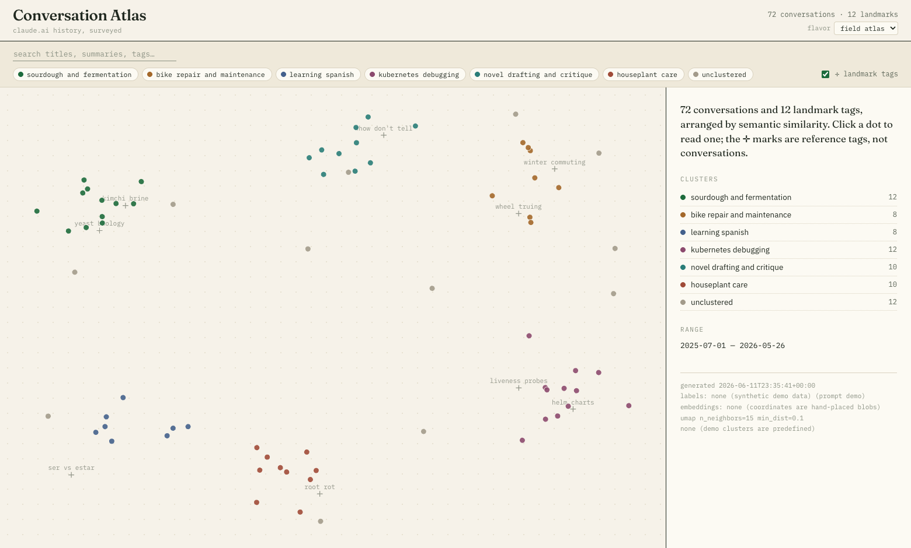

# visualize_claude_convos

Browse your claude.ai conversation history as a 2D semantic map. Conversations
cluster by what they're about, landmark tags label the regions, and clicking a
point opens a drilldown with the summary, tags, and full transcript.



_(Screenshot shows synthetic demo data, not anyone's real conversations.)_

## What's going on

1. Your claude.ai data export is split into per-conversation transcripts
2. Haiku labels each conversation with a summary + ~30 scored tags
3. Each tag is embedded (BGE); a conversation's vector is the score-weighted
   sum of its tag embeddings
4. Haiku consolidates all observed tags into a small "landmark" vocabulary,
   embedded the same way
5. Conversations + landmarks are jointly UMAP'd into 2D; conversations are
   clustered (HDBSCAN on mean-centered vectors); Haiku names the clusters
6. A React + plotly UI renders the map: search, cluster filters, zoom-aware
   landmark labels, per-conversation drilldown, and five switchable design
   flavors

See [PLAN.md](PLAN.md) for the design and [pipeline/README.md](pipeline/README.md)
for stage-by-stage details and caching rules.

## Try it on demo data

No export or API key needed — generates a fake corpus so you can play with the UI:

```
uv run python pipeline/demo_data.py
cd ui && nvm install && npm install && npm run dev
```

## Run it on your own conversations

1. claude.ai → Settings → Privacy → Export data. Unzip so that
   `conversation_data/unzipped/conversations.json` exists
2. Put `ANTHROPIC_API_KEY=sk-ant-...` in `.env`
3. `uv run --env-file .env python pipeline/run_all.py` — a few hundred
   conversations costs a dollar or two of Haiku and takes ~20 minutes
   (labeling is cached, so re-runs only process new conversations)
4. `cd ui && npm run dev`

Everything personal stays local and gitignored (`conversation_data/`,
`pipeline/data/`, `ui/public/data.json`).

## Development

- Open `visualize_claude_convos.code-workspace` in VSCode for format-on-save,
  organize-imports, and eslint wiring
- Python side uses [uv](https://docs.astral.sh/uv/); UI is node 26 (`.nvmrc`),
  Vite + React 19 + TypeScript, with `npm run build` gated on eslint, tsc, and
  prettier
- Spike/experiment code, including earlier iterations of the embed pipeline and
  UI, lives in [`experiments/`](experiments/) — see
  [experiments/README.md](experiments/README.md). More experiments may land
  there over time.

## Ways this could be improved

The "Places of experimentation" section of [PLAN.md](PLAN.md) is the live list:
different embedding models, closed tag vocabularies, clustering variants
(currently ~half the corpus lands in HDBSCAN noise), iterating on the labeling /
landmark / cluster-naming prompts, and time-series analyses of tag frequency.
